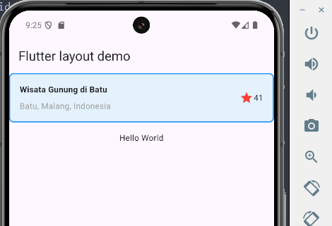
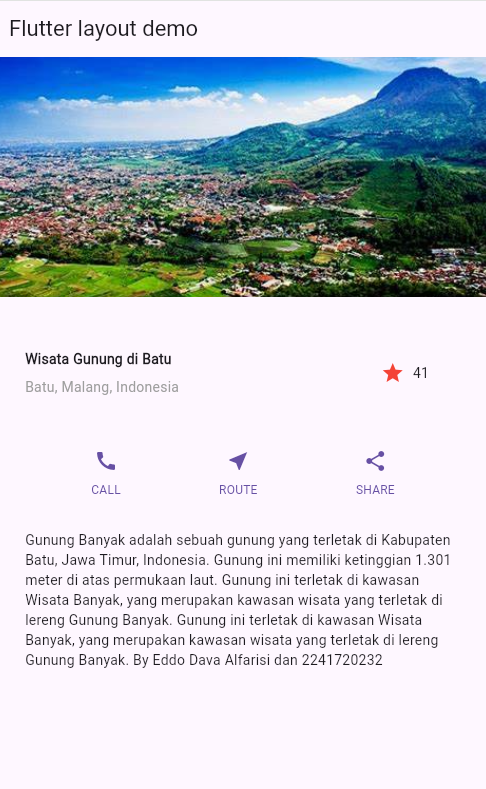

## Penulis

- Eddo Dava Alfarisi
- NIM: 2241720232

# Praktikum 1: Flutter Layout

## Deskripsi

Pada praktikum ini, kita akan membuat sebuah aplikasi Flutter sederhana yang menampilkan informasi wisata gunung di Batu, Malang, Indonesia. Aplikasi ini menggunakan widget dasar Flutter seperti `Container`, `Row`, `Column`, dan `Text`.

## Struktur Proyek

Berikut adalah struktur proyek dari aplikasi ini:

```dart
/d:/Kuliah/Semester 5/Mobile_Ganjil_2024/Layout dan Navigasi/layout_flutter/
│
├───android
│   ├───app
│   │   ├───build.gradle
│   │   └───src
│   │       ├───main
│   │       │   ├───AndroidManifest.xml
│   │       │   ├───java
│   │       │   └───res
│   └───build.gradle
│   ├───asset
│   │   ├───images
│   │       ├───gunung-batu.jpeg
├───ios
│   ├───Runner
│   │   ├───AppDelegate.swift
│   │   ├───Assets.xcassets
│   │   ├───Info.plist
│   │   └───main.swift
│   └───Runner.xcodeproj
├───lib
│   ├───main.dart
├───test
│   ├───widget_test.dart
├───images
│   ├───gunung_batu.jpg
└───pubspec.yaml
├───README.md
```

## Kode Utama

```dart
import 'package:flutter/material.dart';

void main() => runApp(MyApp());

class MyApp extends StatelessWidget {
    @override
    Widget build(BuildContext context) {
        Widget titleSection = Container(
            padding: const EdgeInsets.all(16.0),
            decoration: BoxDecoration(
                color: Colors.blue[50],
                border: Border.all(
                    color: Colors.blue,
                    width: 2,
                ),
                borderRadius: BorderRadius.circular(8),
            ),
            child: Row(
                children: [
                    Expanded(
                        child: Column(
                            crossAxisAlignment: CrossAxisAlignment.start,
                            children: [
                                Container(
                                    padding: const EdgeInsets.only(bottom: 8.0),
                                    child: const Text(
                                        'Wisata Gunung di Batu',
                                        style: TextStyle(
                                            fontWeight: FontWeight.bold,
                                        ),
                                    ),
                                ),
                                Text(
                                    'Batu, Malang, Indonesia',
                                    style: TextStyle(color: Colors.grey[500]),
                                ),
                            ],
                        ),
                    ),
                    Icon(
                        Icons.star,
                        color: Colors.red[500],
                    ),
                    const Text('41'),
                ],
            ),
        );

        return MaterialApp(
            debugShowCheckedModeBanner: false,
            title: 'Flutter layout: Eddo Dava Alfarisi dan 2241720232',
            home: Scaffold(
                appBar: AppBar(
                    title: const Text('Flutter layout demo'),
                ),
                body: Center(
                    child: Column(
                        mainAxisAlignment: MainAxisAlignment.start,
                        children: [
                            titleSection,
                            const Padding(
                                padding: EdgeInsets.all(16.0),
                                child: Text('Hello World'),
                            ),
                        ],
                    ),
                ),
            ),
        );
    }
}
```

## Langkah-langkah

1. **Langkah 1**: Membuat aplikasi Flutter dengan `MaterialApp` dan `Scaffold`.
2. **Langkah 2**: Membuat `titleSection` yang berisi informasi wisata gunung.
   1. **Soal 1**: Menggunakan `Expanded` widget untuk mengatur tata letak.
   2. **Soal 2**: Menambahkan `Container` untuk judul dan lokasi.
   3. **Soal 3**: Menambahkan ikon bintang dan teks jumlah bintang.

## hasil



## Praktikum 2: Button Section

### Deskripsi

Pada praktikum ini, kita akan menambahkan sebuah section yang berisi beberapa tombol dengan ikon dan label menggunakan widget `Row` dan `Column`.

### Langkah-langkah

1. **Langkah 1**: Membuat `buttonSection` yang berisi tiga tombol dengan ikon dan label.
    1. **Soal 1**: Menggunakan `Row` untuk menampung tombol-tombol.
    2. **Soal 2**: Menggunakan `Column` untuk menampilkan ikon dan label secara vertikal.
    3. **Soal 3**: Menggunakan `Icon` dan `Text` untuk membuat tombol.

### Kode

```dart
Widget buttonSection = Row(
  mainAxisAlignment: MainAxisAlignment.spaceEvenly,
  children: [
     _buildButtonColumn(color, Icons.call, 'CALL'),
     _buildButtonColumn(color, Icons.near_me, 'ROUTE'),
     _buildButtonColumn(color, Icons.share, 'SHARE'),
  ],
);

Column _buildButtonColumn(Color color, IconData icon, String label) {
  return Column(
     mainAxisSize: MainAxisSize.min,
     mainAxisAlignment: MainAxisAlignment.center,
     children: [
        Icon(icon, color: color),
        Container(
          margin: const EdgeInsets.only(top: 8),
          child: Text(
             label,
             style: TextStyle(
                fontSize: 12,
                fontWeight: FontWeight.w400,
                color: color,
             ),
          ),
        ),
     ],
  );
}
```

## Praktikum 3: Text Section

### Deskripsi

Pada praktikum ini, kita akan menambahkan sebuah section yang berisi teks deskripsi menggunakan widget `Container` dan `Text`.

### Langkah-langkah

1. **Langkah 1**: Membuat `textSection` yang berisi deskripsi wisata gunung.
    1. **Soal 1**: Menggunakan `Container` untuk membungkus teks.
    2. **Soal 2**: Menggunakan `Text` untuk menampilkan deskripsi.

### Kode

```dart
Widget textSection = Container(
  padding: const EdgeInsets.all(32),
  child: const Text(
     'Gunung Banyak adalah sebuah gunung yang terletak di Kabupaten Batu'
     ', Jawa Timur, Indonesia. Gunung ini memiliki ketinggian 1.301 meter di atas permukaan laut.'
     ' Gunung ini terletak di kawasan Wisata Banyak, yang merupakan kawasan wisata yang terletak di lereng Gunung Banyak. '
     'Gunung ini terletak di kawasan Wisata Banyak, yang merupakan kawasan wisata yang terletak di lereng Gunung Banyak.'
     ' By Eddo Dava Alfarisi dan 2241720232',
     softWrap: true,
  ),
);
```

## Praktikum 4: Image Section

### Deskripsi

Pada praktikum ini, kita akan menambahkan sebuah section yang berisi gambar menggunakan widget `Image`.

### Langkah-langkah

1. **Langkah 1**: Menambahkan gambar wisata gunung di bagian atas layout.
    1. **Soal 1**: Menggunakan `Image.asset` untuk menampilkan gambar dari direktori aset.

### Kode

```dart
Image.asset(
  'images/gunung-batu.jpeg',
  width: 600,
  height: 240,
  fit: BoxFit.cover,
)
```

## Hasil



## Lisensi

Proyek ini dilisensikan di bawah lisensi MIT.
