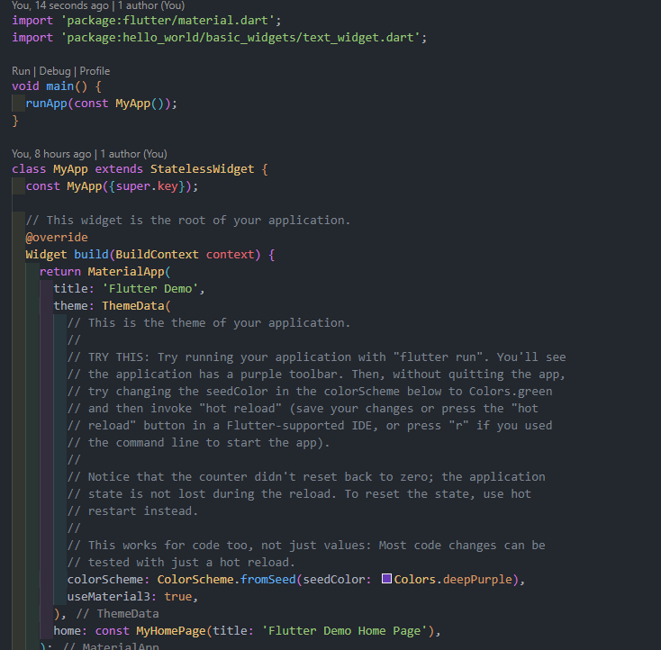
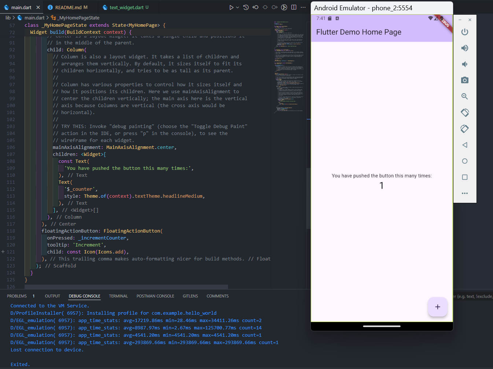
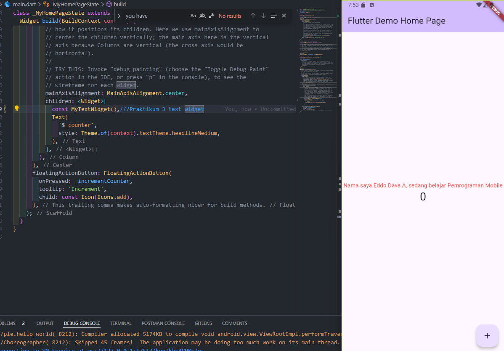
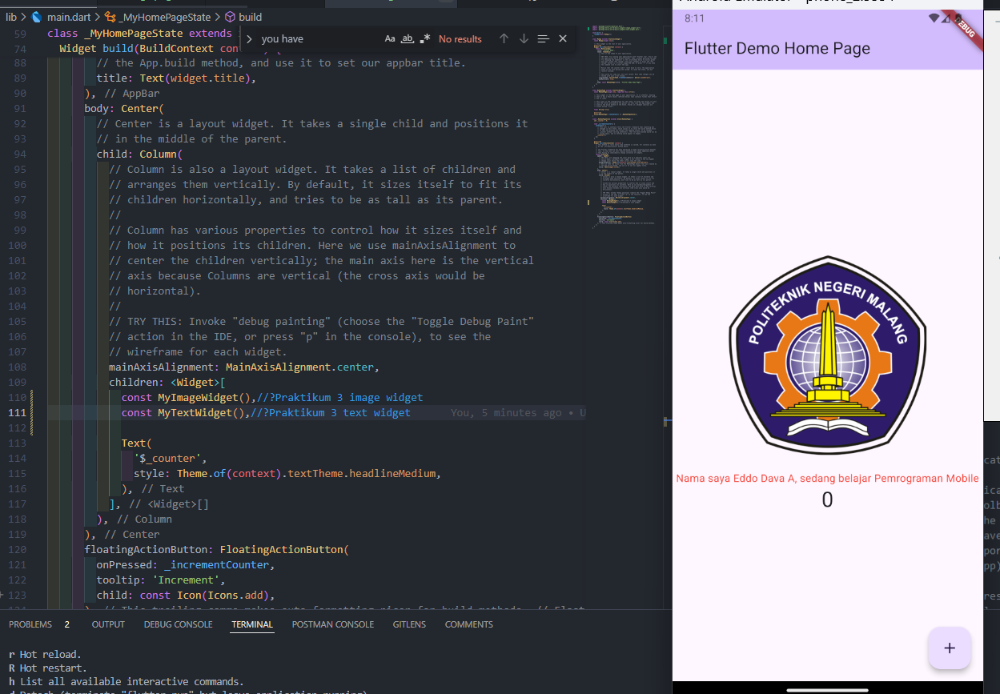
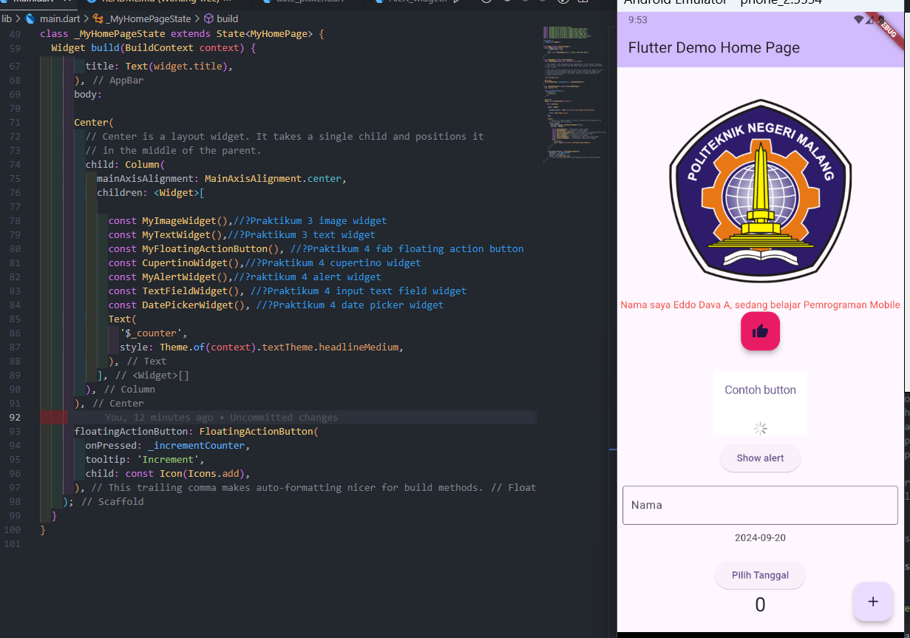

# hello_world

A new Flutter project.

# Praktikum 1

Kode program diatas merupakan kode program template application yang sudah disediakan oleh flutter itu semdiri 
# Praktikum 2
Hasil

_MyHomePageState adalah State dari widget MyHomePage. Kelas State digunakan untuk widget yang memiliki data yang dapat berubah (stateful).
StatefulWidget seperti MyHomePage memisahkan deklarasi widget (bagian yang dapat diubah) dan logika perubahan state di dalam kelas State.

```dart
Widget build(BuildContext context) {
  return Scaffold(
    body: Center(
      child: Column(
        mainAxisAlignment: MainAxisAlignment.center,
        children: <Widget>[
          const Text(
            'You have pushed the button this many times:',
          ),
          Text(
            '$_counter',
            style: Theme.of(context).textTheme.headlineMedium,
          ),
        ],
      ),
    ),
    floatingActionButton: FloatingActionButton(
      onPressed: _incrementCounter,
      tooltip: 'Increment',
      child: const Icon(Icons.add),
    ),
  );
}

```

1. build(BuildContext context): Fungsi ini membangun UI dari widget berdasarkan state saat ini.
2. Scaffold: Widget yang menyediakan struktur dasar visual seperti AppBar, Drawer, FloatingActionButton, dan area konten utama.
3. Center: Widget yang membuat anak-anaknya berada di tengah layar.
4. Column: Widget tata letak vertikal yang mengatur widget di dalamnya secara vertikal.
mainAxisAlignment: MainAxisAlignment.center: Menyelaraskan widget secara vertikal di tengah-tengah kolom.
5. children: Menentukan daftar widget yang akan ditampilkan di dalam kolom.
Text: Menampilkan teks statis "You have pushed the button this many times:".
6. $_counter: Variabel counter yang akan menampilkan jumlah berapa kali tombol ditekan.
Theme.of(context).textTheme.headlineMedium: Mengatur gaya teks menggunakan tema dari aplikasi.
7. floatingActionButton: Tombol melayang yang digunakan untuk melakukan aksi (di sini digunakan untuk menambah nilai counter).
8. onPressed: _incrementCounter: Ketika tombol ditekan, fungsi _incrementCounter dipanggil.
child: Icon(Icons.add): Menampilkan ikon tambah di dalam tombol.
# Praktikum 3

## text widget


## text_widget.dart

```dart
import 'package:flutter/material.dart';

class MyTextWidget extends StatelessWidget {
  const MyTextWidget({Key? key}) : super(key: key);

  @override
  Widget build(BuildContext context) {
    return const Text(
      "Nama saya Eddo Dava A, sedang belajar Pemrograman Mobile",
      style: TextStyle(color: Colors.red, fontSize: 14),
      textAlign: TextAlign.center,
    );
  }
}
```

Penjelasan: <br>
1. MyTextWidget adalah kelas yang merupakan turunan dari StatelessWidget, yang berarti widget ini tidak memiliki state atau data yang dapat berubah. <br>
2. Di dalam metode build, widget Text digunakan untuk menampilkan teks "Nama saya Eddo Dava A, sedang belajar Pemrograman Mobile".
3. Teks ini diberikan gaya menggunakan TextStyle dengan warna merah (Colors.red) dan ukuran font sebesar 14.
textAlign diatur ke TextAlign.center, yang memastikan bahwa teks berada di tengah secara horizontal.

## image widget

```dart
import 'package:flutter/material.dart';

class MyImageWidget extends StatelessWidget {
  const MyImageWidget({Key? key}) : super(key: key);

  @override
  Widget build(BuildContext context) {
    return const Image(
      image: AssetImage("assets/images/Logo_polinema.png"),
    );
  }
}
```
Penjelasan:
1. MyImageWidget juga merupakan turunan dari StatelessWidget, artinya tidak ada data yang bisa berubah dalam widget ini.
2. Widget Image digunakan untuk menampilkan gambar dari aset lokal dengan path "assets/images/Logo_polinema.png".
3. Gambar ini diambil dari direktori assets/images, yang harus dideklarasikan di dalam file pubspec.yaml untuk memastikan bahwa gambar dapat diakses oleh aplikasi.

# Praktikum 4


pada praktikum ini terdapat beberapa kode antara lain

## Alert_widget.dart

```dart
import 'package:flutter/material.dart';

class MyAlertWidget extends StatelessWidget {
  const MyAlertWidget({Key? key}) : super(key: key);

  @override
  Widget build(BuildContext context) {
    return Padding(
      padding: const EdgeInsets.all(8.0),
      child: ElevatedButton(
        child: const Text('Show alert'),
        onPressed: () {
          _showAlertDialog(context); // Panggil fungsi di sini
        },
      ),
    );
  }

  void _showAlertDialog(BuildContext context) {
    // set up the button
    Widget okButton = TextButton(
      child: const Text("OK"),
      onPressed: () {
        Navigator.pop(context);
      },
    );

    // set up the AlertDialog
    AlertDialog alert = AlertDialog(
      title: const Text("My title"),
      content: const Text("This is my message."),
      actions: [
        okButton,
      ],
    );

    // show the dialog
    showDialog(
      context: context,
      builder: (BuildContext context) {
        return alert;
      },
    );
  }
}
```

Penjelasan:<br>
1. MyAlertWidget adalah kelas turunan dari StatelessWidget, yang berarti widget ini tidak memiliki state yang berubah.
2. Di dalam metode build, widget ini menggunakan Padding untuk memberi jarak sekitar 8 piksel di sekitar ElevatedButton.
3. ElevatedButton adalah tombol yang akan menampilkan teks "Show alert", dan ketika ditekan, akan memanggil fungsi _showAlertDialog dengan parameter context.

<br>
_showAlertDialog Method:
Fungsi _showAlertDialog digunakan untuk menampilkan sebuah AlertDialog.

1. Di dalam dialog, ada sebuah widget TextButton dengan label "OK" yang digunakan sebagai tombol tindakan.

2. Ketika tombol "OK" ditekan, fungsi Navigator.pop(context) dipanggil untuk menutup dialog dan kembali ke tampilan sebelumnya.
  
AlertDialog terdiri dari:

1. Title: Menampilkan judul dialog, yaitu "My title".
2. Content: Menampilkan pesan dalam dialog, yaitu "This is my message.".
3. Actions: Menyediakan tombol "OK" yang diatur untuk menutup dialog.
4. showDialog adalah fungsi bawaan Flutter untuk menampilkan dialog pada layar. Fungsi ini memerlukan context dan builder yang mengembalikan widget AlertDialog.


## date_picker.dart

```dart
import 'dart:async';
import 'package:flutter/material.dart';

class DatePickerWidget extends StatefulWidget {
  const DatePickerWidget({Key? key}) : super(key: key);

  @override
  _DatePickerWidgetState createState() => _DatePickerWidgetState();
}

class _DatePickerWidgetState extends State<DatePickerWidget> {
  DateTime selectedDate = DateTime.now(); // Variable/State untuk tanggal

  // Initial SelectDate Flutter
  Future<void> _selectDate(BuildContext context) async {
    final DateTime? picked = await showDatePicker(
      context: context,
      initialDate: selectedDate,
      firstDate: DateTime(2015, 8),
      lastDate: DateTime(2101),
    );
    if (picked != null && picked != selectedDate) {
      setState(() {
        selectedDate = picked;
      });
    }
  }

  @override
  Widget build(BuildContext context) {
    return Center(
      child: Column(
        mainAxisSize: MainAxisSize.min,
        children: <Widget>[
          Text("${selectedDate.toLocal()}".split(' ')[0]), // Menampilkan tanggal
          const SizedBox(height: 20.0),
          ElevatedButton(
            onPressed: () {
              _selectDate(context);
              // ignore: avoid_print
              print(selectedDate.day + selectedDate.month + selectedDate.year);
            },
            child: const Text('Pilih Tanggal'),
          ),
        ],
      ),
    );
  }
}
```
- Variabel selectedDate digunakan untuk menyimpan tanggal yang dipilih, dengan nilai awal diinisialisasi sebagai tanggal saat ini (DateTime.now()).
- Fungsi _selectDate adalah fungsi asinkron yang menampilkan dialog pemilihan tanggal menggunakan showDatePicker. Fungsi ini menunggu hingga pengguna memilih tanggal, dan hasilnya disimpan ke dalam variabel picked.
    - initialDate: Tanggal awal yang akan ditampilkan di picker, yaitu tanggal yang tersimpan di variabel selectedDate.
    - firstDate: Tanggal paling awal yang bisa dipilih, yaitu 1 Agustus 2015.
    - lastDate: Tanggal paling akhir yang bisa dipilih, yaitu 1 Januari 2101.
Jika pengguna memilih tanggal yang berbeda dari tanggal sebelumnya, maka setState akan dipanggil untuk memperbarui nilai selectedDate dan me-refresh tampilan.

fab_widget.dart
```dart
import 'package:flutter/material.dart';

class MyFloatingActionButton extends StatelessWidget {
  const MyFloatingActionButton({Key? key}) : super(key: key);

  @override
  Widget build(BuildContext context) {
    return FloatingActionButton(
      onPressed: () {
        // Tambahkan aksi ketika tombol ditekan
        // ignore: avoid_print
        print('Floating Action Button Pressed!');
      },
      child: const Icon(Icons.thumb_up),
      backgroundColor: Colors.pink,
    );
  }
}
```
MyFloatingActionButton adalah sebuah kelas turunan dari StatelessWidget, yang berarti widget ini tidak memiliki state yang berubah.
Di dalam metode build, widget ini menggunakan FloatingActionButton sebagai tombol utama. FloatingActionButton adalah tombol melayang yang biasanya digunakan di sudut kanan bawah layar untuk mengeksekusi tindakan tertentu.

## input_widget.dart
```dart
import 'package:flutter/material.dart';

class TextFieldWidget extends StatelessWidget {
  const TextFieldWidget({Key? key}) : super(key: key);

  @override
  Widget build(BuildContext context) {
    return const Padding(
      padding: EdgeInsets.all(8.0),
      child: TextField(
        obscureText: false,
        decoration: InputDecoration(
          border: OutlineInputBorder(),
          labelText: 'Nama',
        ),
      ),
    );
  }
}
```
Widget ini digunakan untuk membuat input teks di aplikasi Flutter menggunakan widget TextField.

- obscureText: Menentukan apakah teks yang dimasukkan harus disembunyikan (misalnya untuk input password). Pada contoh ini, nilai false berarti teks yang dimasukkan akan terlihat secara jelas.

- decoration: Digunakan untuk memberikan dekorasi pada TextField. Dalam kode ini, digunakan objek InputDecoration dengan beberapa pengaturan:

- border: Mengatur tampilan perbatasan dari TextField. Pada contoh ini digunakan OutlineInputBorder yang memberikan batas kotak di sekitar area input teks.
labelText: Memberikan label atau keterangan pada input teks. Label ini akan muncul di atas input saat pengguna mulai mengetik, dengan teks 'Nama'.

## loading_cupertino.dart
```dart
import 'package:flutter/material.dart';
import 'package:flutter/cupertino.dart';

class CupertinoWidget extends StatelessWidget {
  const CupertinoWidget({Key? key}) : super(key: key);

  @override
  Widget build(BuildContext context) {
    return Container(
      margin: const EdgeInsets.only(top: 30),
      color: Colors.white,
      child: Column(
        children: <Widget>[
          CupertinoButton(
            child: const Text("Contoh button"),
            onPressed: () {
              // Aksi ketika button ditekan
            },
          ),
          const SizedBox(height: 20), // Memberi sedikit jarak
          const CupertinoActivityIndicator(), // Menampilkan loading indicator
        ],
      ),
    );
  }
}
```
Kelas CupertinoWidget

Kelas ini adalah subclass dari ```StatelessWidget```, yang berarti tidak memiliki state yang berubah-ubah selama aplikasi berjalan.

Fungsi ```build```
Fungsi ini mendefinisikan tampilan UI dari widget. Dalam fungsi ini, kita membangun struktur UI dengan menggunakan beberapa widget.

Widget ```Container```
Container digunakan sebagai pembungkus utama, dengan margin atas sebesar 30 piksel dan warna latar belakang putih.

Widget ```Column```
Column digunakan untuk menampilkan widget secara vertikal. Di dalamnya terdapat:
1. ```CupertinoButton```: Tombol dengan teks "Contoh button" yang dapat diklik. Aksi yang terjadi saat tombol ditekan bisa didefinisikan di dalam fungsi onPressed.
2. ```SizedBox```: Memberikan jarak vertikal sebesar 20 piksel antara tombol dan indikator loading.
3. ```CupertinoActivityIndicator```: Menampilkan indikator loading khas iOS.