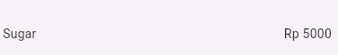
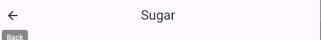
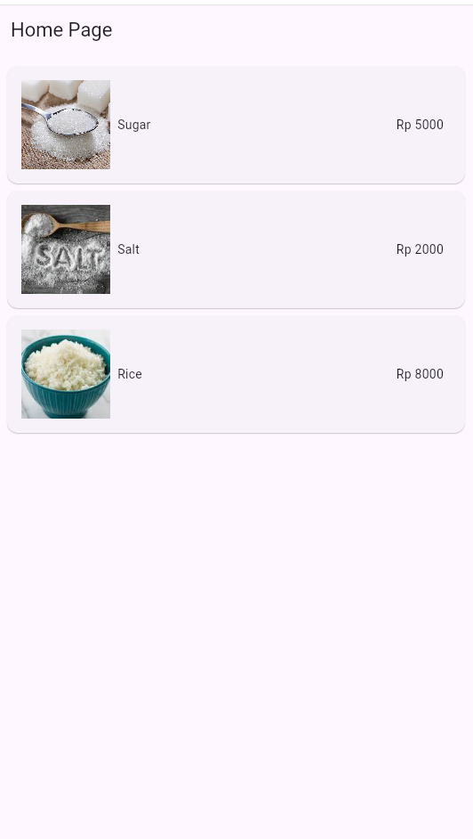
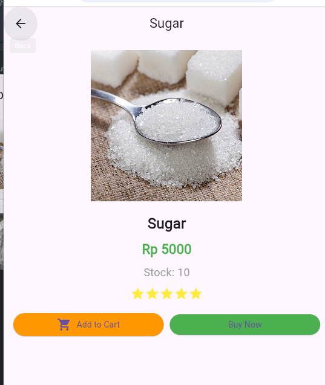
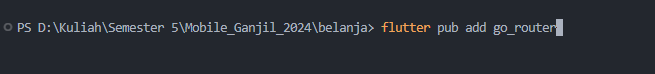

# Laporan Praktikum Flutter

## Apa yang dipelajari
- Cara kerja mekanisme navigasi dan rute di Flutter.
- Cara membuat navigasi dan rute di Flutter.


## Langkah-langkah Praktikum

### Langkah 1: Siapkan proyek baru
Sebelum melanjutkan praktikum, buatlah sebuah proyek baru Flutter dengan nama `belanja` dan susunan folder seperti pada gambar berikut. Penyusunan ini dimaksudkan untuk mengorganisasi kode dan widget yang lebih mudah.

### Langkah 2: Mendefinisikan Rute
Buatlah dua buah file dart dengan nama `home_page.dart` dan `item_page.dart` pada folder `pages`. Untuk masing-masing file, deklarasikan kelas `HomePage` pada file `home_page.dart` dan `ItemPage` pada `item_page.dart`. Turunkan kelas dari `StatelessWidget`. Gambaran potongan kode dapat Anda lihat sebagai berikut.

```dart

class HomePage extends StatelessWidget {
  HomePage({super.key});

    @override
    Widget build(BuildContext context){
        throw unImplementedError();
    }
}
```


### Langkah 3: Lengkapi Kode di `main.dart`
Setelah kedua halaman telah dibuat dan didefinisikan, bukalah file `main.dart`. Pada langkah ini, Anda akan mendefinisikan rute untuk kedua halaman tersebut. Definisi penamaan rute harus bersifat unik. Halaman `HomePage` didefinisikan sebagai `/`. Dan halaman `ItemPage` didefinisikan sebagai `/item`. Untuk mendefinisikan halaman awal, Anda dapat menggunakan named argument `initialRoute`. Gambaran tahapan ini dapat Anda lihat pada potongan kode berikut.

```dart
import 'package:flutter/material.dart';
import 'pages/home_page.dart';
import 'pages/item_page.dart';

// langkah 3 Mendefinisikan route
void main() {
  runApp(MaterialApp(
    debugShowCheckedModeBanner: false,
    initialRoute: '/',
    routes: {
      '/': (context) => HomePage(),
      '/item': (context) => ItemPage(),
    },
  ));
}

```

### Langkah 4: Membuat data model
Sebelum melakukan perpindahan halaman dari `HomePage` ke `ItemPage`, dibutuhkan proses pemodelan data. Pada desain mockup, dibutuhkan dua informasi yaitu nama dan harga. Untuk menangani hal ini, buatlah sebuah file dengan nama `item.dart` dan letakkan pada folder `models`. Pada file ini, didefinisikan pemodelan data yang dibutuhkan. Ilustrasi kode yang dibutuhkan dapat Anda lihat pada potongan kode berikut.

```dart
class Item {
  String name;
  int price;

    Item({required this.name,required this.price,});
}
```


### Langkah 5: Lengkapi kode di kelas `HomePage`
Pada halaman `HomePage` terdapat widget `ListView`. Sumber data `ListView` diambil dari model List dari objek `Item`. Gambaran kode yang dibutuhkan untuk melakukan definisi model dapat Anda lihat sebagai berikut.

```dart
 final List<Item> items = [
    Item(name: 'Sugar', price: 5000, foto: 'assets/images/sugar.jpg', stok: 10, rating: 5),
    Item(name: 'Salt', price: 2000, foto: 'assets/images/salt.jpeg', stok: 5, rating: 4),
    Item(name: 'Rice', price: 8000, foto: 'assets/images/rice.jpeg', stok: 2, rating: 3),
  ];

```

### Langkah 6: Membuat `ListView` dan `itemBuilder`
Untuk menampilkan `ListView` pada praktikum ini digunakan `itemBuilder`. Data diambil dari definisi model yang telah dibuat sebelumnya. Untuk menunjukkan batas data satu dan berikutnya digunakan widget `Card`. Kode yang telah umum pada bagian ini tidak ditampilkan. Gambaran kode yang dibutuhkan dapat Anda lihat sebagai berikut.

```dart
body: Container(
    margin: EdgeInsets.all(8),
    child: ListView. builder(
        padding: EdgeInsets.all(8),
        itemCount: items. length,
        itemBuilder: (context, index) {
        final item = items [index];
        return Card(
            child: Container(
                margin: EdgeInsets.all(8),
                child: Row(
                    children: [
                        Expanded(child: Text(item.name)),
                            Expanded(   
                            child: Text(
                            item.price.toString(),
                            textAlign: TextAlign. end,
                            ), // Text
                            ) // Expanded
                        ],
                    ), // Row
                ), // Container
            ); // Card
        },
    ), // ListView.builder
), // Container

```

**Perhatian:** Pastikan pada halaman awal telah berhasil menampilkan `ListView`. Jika ada kesalahan, segera perbaiki sebelum melanjutkan ke langkah berikutnya.

### Langkah 7: Menambahkan aksi pada `ListView`
Item pada `ListView` saat ini ketika ditekan masih belum memberikan aksi tertentu. Untuk menambahkan aksi pada `ListView` dapat digunakan widget `InkWell` atau `GestureDetector`. Perbedaan utamanya, `InkWell` merupakan material widget yang memberikan efek ketika ditekan. Sedangkan `GestureDetector` bersifat umum dan bisa juga digunakan untuk gesture lain selain sentuhan. Pada praktikum ini akan digunakan widget `InkWell`.

Untuk menambahkan sentuhan, letakkan kursor pada widget pembuka `Card`. Kemudian gunakan shortcut quick fix dari VSCode (Ctrl + . pada Windows atau Cmd + . pada MacOS). Sorot menu wrap with widget... Ubah nilai widget menjadi `InkWell` serta tambahkan named argument `onTap` yang berisi fungsi untuk berpindah ke halaman `ItemPage`. Ilustrasi potongan kode dapat Anda lihat pada potongan berikut.

```dart
return InkWell(
    onTap:(){
        Navigator.pushNamed(context,'/item')
    }
)
```
 hasilnya adalah ketika ini diklik

 
 
 maka akan tampil ke halaman selanjutnya
 

 ## tugas 

1. Untuk melakukan pengiriman data ke halaman berikutnya, cukup menambahkan informasi arguments pada penggunaan Navigator. Perbarui kode pada bagian Navigator menjadi seperti berikut. 

```dart
Navigator.pushNamed(context, '/item', arguments: item);
```

jadi data dikirim dalam bentuk argumen

2.  sedabgkan untuk pembacaan adalah sebagai berikut
    ```dart 
    final itemArgs = ModalRoute.of(context)!.settings.arguments as Item;
    ```
    
3.   Pada hasil akhir dari aplikasi belanja yang telah anda selesaikan, tambahkan atribut foto produk, stok, dan rating. Ubahlah tampilan menjadi GridView seperti di aplikasi marketplace pada umumnya. jadi ini sekalian saya hias juga 
4.   Silakan implementasikan Hero widget pada aplikasi belanja Anda dengan mempelajari dari sumber ini: https://docs.flutter.dev/cookbook/navigation/hero-animations 
berikut adalah kode program dan hasilnya untuk no  3 dan 4

Homepage.dart
```dart
import 'package:flutter/material.dart';
import 'package:belanja/models/item.dart'; 

class HomePage extends StatelessWidget {
  HomePage({super.key});
  
  final List<Item> items = [
    Item(name: 'Sugar', price: 5000, foto: 'assets/images/sugar.jpg', stok: 10, rating: 5),
    Item(name: 'Salt', price: 2000, foto: 'assets/images/salt.jpeg', stok: 5, rating: 4),
    Item(name: 'Rice', price: 8000, foto: 'assets/images/rice.jpeg', stok: 2, rating: 3),
  ];

  @override
  Widget build(BuildContext context) {
    return Scaffold(
      appBar: AppBar(
        title: const Text('Home Page'),
      ),
      body: Container(
        margin: const EdgeInsets.all(8),
        child: ListView.builder(
          itemCount: items.length,
          itemBuilder: (context, index) {
            final item = items[index];
            return InkWell(
              onTap: () {
                Navigator.pushNamed(context, '/item', arguments: item);
              },
              child: Card(
                child: Container(
                  padding: const EdgeInsets.all(8),
                  margin: const EdgeInsets.all(8),
                  child: Row(
                    children: [
                      // Wrap image in Hero widget
                      Hero(
                        tag: item.name,  // Using item name as unique tag
                        child: Image.asset(item.foto, width: 100, height: 100, fit: BoxFit.cover),
                      ),
                      Expanded(
                        child:
                        Container(
                          padding :const EdgeInsets.all(8),
                          child:
                          Text(item.name),
                        ) 
                      ),
                      Expanded(
                        child:Container(
                          padding: const EdgeInsets.all(8),
                          child: Text(
                          'Rp ${item.price}',
                          textAlign: TextAlign.end,
                        ),
                        ) 
                      ),
                    ],
                  ),
                ),
              ),
            );
          },
        ),
      ),
    );
  }
}

```

item_page.dart
```dart
import 'package:belanja/models/item.dart';
import 'package:flutter/material.dart';

class ItemPage extends StatelessWidget {
  const ItemPage({super.key});

  @override
  Widget build(BuildContext context) {
    final Item? item = ModalRoute.of(context)?.settings.arguments as Item?;
    
    if (item == null) {
      return Scaffold(
        appBar: AppBar(
          title: const Text("Item Not Found"),
        ),
        body: const Center(
          child: Text("Item not found or invalid data passed."),
        ),
      );
    }

    return Scaffold(
      appBar: AppBar(
        title: Text(item.name),
        centerTitle: true,
      ),
      body: Padding(
        padding: const EdgeInsets.all(16.0),
        child: Column(
          crossAxisAlignment: CrossAxisAlignment.center,
          children: [
            // Wrap image in Hero widget
            Hero(
              tag: item.name,  // Same tag as in HomePage
              child: Image.asset(
                item.foto,
                width: 250,
                height: 250,
                fit: BoxFit.cover,
              ),
            ),
            const SizedBox(height: 20),
            Text(
              item.name,
              style: const TextStyle(
                  fontSize: 24, fontWeight: FontWeight.bold),
            ),
            const SizedBox(height: 10),
            Text(
              'Rp ${item.price}',
              style: const TextStyle(
                  fontSize: 22, color: Colors.green, fontWeight: FontWeight.bold),
            ),
            const SizedBox(height: 10),
            Text(
              'Stock: ${item.stok}',
              style: const TextStyle(
                  fontSize: 18, color: Colors.grey),
            ),
            const SizedBox(height: 10),
            Row(
              mainAxisAlignment: MainAxisAlignment.center,
              children: List.generate(5, (index) {
                return Icon(
                  index < item.rating
                      ? Icons.star
                      : Icons.star_border,
                  color: Colors.yellow,
                );
              }),
            ),
            const SizedBox(height: 20),
            Row(
              children: [
                Expanded(
                  child: ElevatedButton.icon(
                    onPressed: () {
                      // Add to Cart action
                    },
                    icon: const Icon(Icons.shopping_cart),
                    label: const Text('Add to Cart'),
                    style: ElevatedButton.styleFrom(
                      backgroundColor: Colors.orange,
                      padding: const EdgeInsets.symmetric(vertical: 15),
                    ),
                  ),
                ),
                const SizedBox(width: 10),
                Expanded(
                  child: ElevatedButton(
                    onPressed: () {
                      // Buy Now action
                    },
                    child: const Text('Buy Now'),
                    style: ElevatedButton.styleFrom(
                      backgroundColor: Colors.green,
                      padding: const EdgeInsets.symmetric(vertical: 15),
                    ),
                  ),
                ),
              ],
            ),
          ],
        ),
      ),
    );
  }
}

```

berikut adalah hasilnya
home page


item page



hero animation
<video controls src="src_md/hero.mp4" title="Title"></video>

5. Sesuaikan dan modifikasi tampilan sehingga menjadi aplikasi yang menarik. Selain itu, pecah widget menjadi kode yang lebih kecil. Tambahkan Nama dan NIM di footer aplikasi belanja Anda.

oke sekarang saya akan memodifikasi dan menambahkan footer


1. **Membuat widget untuk item card di `HomePage`.**
2. **Menambahkan widget Footer di `HomePage` dan `ItemPage`.**
3. **Mengatur widget `Footer` untuk menampilkan Nama dan NIM.**

### Modifikasi 1: Pecah item card menjadi widget tersendiri
`widgets/item_card.dart`:

```dart
import 'package:flutter/material.dart';
import 'package:belanja/models/item.dart';

class ItemCard extends StatelessWidget {
  final Item item;
  final VoidCallback onTap;

  const ItemCard({super.key, required this.item, required this.onTap});

  @override
  Widget build(BuildContext context) {
    return InkWell(
      onTap: onTap,
      child: Card(
        child: Container(
          padding: const EdgeInsets.all(8),
          margin: const EdgeInsets.all(8),
          child: Row(
            children: [
              Hero(
                tag: item.name,  
                child: Image.asset(item.foto, width: 100, height: 100, fit: BoxFit.cover),
              ),
              Expanded(
                child: Container(
                  padding: const EdgeInsets.all(8),
                  child: Text(item.name),
                ),
              ),
              Expanded(
                child: Container(
                  padding: const EdgeInsets.all(8),
                  child: Text(
                    'Rp ${item.price}',
                    textAlign: TextAlign.end,
                  ),
                ),
              ),
            ],
          ),
        ),
      ),
    );
  }
}
```

Kemudian di `HomePage`, ubah `itemBuilder` untuk menggunakan widget `ItemCard`:

```dart
import 'package:belanja/models/item.dart';
import 'package:flutter/material.dart';
import 'item_card.dart';  // import file ItemCard

class HomePage extends StatelessWidget {
  HomePage({super.key});

  final List<Item> items = [
    Item(name: 'Sugar', price: 5000, foto: 'assets/images/sugar.jpg', stok: 10, rating: 5),
    Item(name: 'Salt', price: 2000, foto: 'assets/images/salt.jpeg', stok: 5, rating: 4),
    Item(name: 'Rice', price: 8000, foto: 'assets/images/rice.jpeg', stok: 2, rating: 3),
  ];

  @override
  Widget build(BuildContext context) {
    return Scaffold(
      appBar: AppBar(
        title: const Text('Home Page'),
      ),
      body: Column(
        children: [
          Expanded(
            child: ListView.builder(
              itemCount: items.length,
              itemBuilder: (context, index) {
                final item = items[index];
                return ItemCard(
                  item: item,
                  onTap: () {
                    Navigator.pushNamed(context, '/item', arguments: item);
                  },
                );
              },
            ),
          ),
          const Footer(), // Tambahkan Footer di sini
        ],
      ),
    );
  }
}
```

### Modifikasi 2: Tambahkan Footer untuk Nama dan NIM
Buat widget `Footer` untuk menampilkan Nama dan NIM:

```dart
import 'package:flutter/material.dart';

class Footer extends StatelessWidget {
  const Footer({super.key});

  @override
  Widget build(BuildContext context) {
    return Container(
      width: double.infinity, // Memastikan lebar mengikuti lebar device
      padding: const EdgeInsets.all(16),
      margin: const EdgeInsets.only(top: 10),
      decoration: BoxDecoration(
        color: Colors.grey.shade200,
        borderRadius: BorderRadius.circular(12),
        boxShadow: [
          BoxShadow(
            color: Colors.black12,
            spreadRadius: 2,
            blurRadius: 6,
          ),
        ],
      ),
      child: Column(
        children: const [
          Text(
            'Nama: Eddo Dava Alfarisi',
            textAlign: TextAlign.center,
            style: TextStyle(
              fontSize: 16,
              fontWeight: FontWeight.bold,
              color: Colors.black87,
            ),
          ),
          SizedBox(height: 4),
          Text(
            'NIM: 2241720232',
            textAlign: TextAlign.center,
            style: TextStyle(
              fontSize: 16,
              fontWeight: FontWeight.bold,
              color: Colors.black87,
            ),
          ),
        ],
      ),
    );
  }
}

```

Kemudian di `ItemPage`, tambahkan `Footer`:

```dart
import 'package:belanja/models/item.dart';
import 'package:flutter/material.dart';
import 'footer.dart';  // import Footer

class ItemPage extends StatelessWidget {
  const ItemPage({super.key});

  @override
  Widget build(BuildContext context) {
    final Item? item = ModalRoute.of(context)?.settings.arguments as Item?;

    if (item == null) {
      return Scaffold(
        appBar: AppBar(
          title: const Text("Item Not Found"),
        ),
        body: const Center(
          child: Text("Item not found or invalid data passed."),
        ),
      );
    }

    return Scaffold(
      appBar: AppBar(
        title: Text(item.name),
        centerTitle: true,
      ),
      body: Column(
        children: [
          Expanded(
            child: Padding(
              padding: const EdgeInsets.all(16.0),
              child: Column(
                crossAxisAlignment: CrossAxisAlignment.center,
                children: [
                  Hero(
                    tag: item.name,  
                    child: Image.asset(
                      item.foto,
                      width: 250,
                      height: 250,
                      fit: BoxFit.cover,
                    ),
                  ),
                  const SizedBox(height: 20),
                  Text(
                    item.name,
                    style: const TextStyle(fontSize: 24, fontWeight: FontWeight.bold),
                  ),
                  const SizedBox(height: 10),
                  Text(
                    'Rp ${item.price}',
                    style: const TextStyle(fontSize: 22, color: Colors.green, fontWeight: FontWeight.bold),
                  ),
                  const SizedBox(height: 10),
                  Text(
                    'Stock: ${item.stok}',
                    style: const TextStyle(fontSize: 18, color: Colors.grey),
                  ),
                  const SizedBox(height: 10),
                  Row(
                    mainAxisAlignment: MainAxisAlignment.center,
                    children: List.generate(5, (index) {
                      return Icon(
                        index < item.rating ? Icons.star : Icons.star_border,
                        color: Colors.yellow,
                      );
                    }),
                  ),
                ],
              ),
            ),
          ),
          const Footer(),  // Tambahkan Footer di sini
        ],
      ),
    );
  }
}
```

### Hasil Akhir
- `ItemCard` memecah UI untuk setiap item menjadi widget kecil.
- `Footer` menampilkan Nama dan NIM di bagian bawah halaman.

<video controls src="src_md/hasil no 5.mp4" title="**Title**"></video>


6. melanjutkan modifikasi menggunakan go_router


### installing

maka pada pubspec dan yaml akan ditambahkan ini
```yaml
dependencies:
  flutter:
    sdk: flutter
  

  # The following adds the Cupertino Icons font to your application.
  # Use with the CupertinoIcons class for iOS style icons.
  cupertino_icons: ^1.0.8
  go_router: ^14.3.0

```


pada main.dart
```dart
import 'package:flutter/material.dart';
import 'package:go_router/go_router.dart';
import 'pages/home_page.dart';
import 'pages/item_page.dart';
import 'models/item.dart';

void main() {
  runApp(const MyApp());
}

class MyApp extends StatelessWidget {
  const MyApp({super.key});

  @override
  Widget build(BuildContext context) {
    final GoRouter _router = GoRouter(
      routes: [
        GoRoute(
          path: '/',
          builder: (context, state) => HomePage(),
        ),
        GoRoute(
          path: '/item/:name',
          builder: (context, state) {
            // Extracting arguments from the route
            final item = state.extra as Item?; 
            return ItemPage(item: item);
          },
        ),
      ],
    );

    return MaterialApp.router(
      debugShowCheckedModeBanner: false,
      routerConfig: _router,
    );
  }
}

```
Modifikasi yang dilakukan:
GoRouter untuk routing: Saya menggunakan GoRouter untuk mendefinisikan rute dengan path dinamis untuk detail item (/item/:name).
Rute dinamis: Saat membuka halaman item, saya mengambil data item melalui state.extra, yang dikirim dari HomePage.

pada home_page.dart
```dart
import 'package:flutter/material.dart';
import 'package:go_router/go_router.dart';
import 'models/item.dart';

class HomePage extends StatelessWidget {
  HomePage({super.key});

  final List<Item> items = [
    Item(name: 'Sugar', price: 5000, foto: 'assets/images/sugar.jpg', stok: 10, rating: 5),
    Item(name: 'Salt', price: 2000, foto: 'assets/images/salt.jpeg', stok: 5, rating: 4),
    Item(name: 'Rice', price: 8000, foto: 'assets/images/rice.jpeg', stok: 2, rating: 3),
  ];

  @override
  Widget build(BuildContext context) {
    return Scaffold(
      appBar: AppBar(
        title: const Text('Home Page'),
      ),
      body: Container(
        margin: const EdgeInsets.all(8),
        child: ListView.builder(
          itemCount: items.length,
          itemBuilder: (context, index) {
            final item = items[index];
            return InkWell(
              onTap: () {
                // Navigate to the item page using GoRouter
                context.go('/item/${item.name}', extra: item);
              },
              child: Card(
                child: Container(
                  padding: const EdgeInsets.all(8),
                  margin: const EdgeInsets.all(8),
                  child: Row(
                    children: [
                      Hero(
                        tag: item.name,
                        child: Image.asset(item.foto, width: 100, height: 100, fit: BoxFit.cover),
                      ),
                      Expanded(
                        child: Container(
                          padding: const EdgeInsets.all(8),
                          child: Text(item.name),
                        ),
                      ),
                      Expanded(
                        child: Container(
                          padding: const EdgeInsets.all(8),
                          child: Text(
                            'Rp ${item.price}',
                            textAlign: TextAlign.end,
                          ),
                        ),
                      ),
                    ],
                  ),
                ),
              ),
            );
          },
        ),
      ),
    );
  }
}

```

Perubahan yang dilakukan:
Navigasi dengan context.go(): Ini menggantikan Navigator.push dan memanfaatkan URL berbasis rute dari go_router.
extra: Mengirimkan objek item saat navigasi, yang diambil pada halaman tujuan.

<video controls src="src_md/hasil akhir.mp4" title="Title"></video>