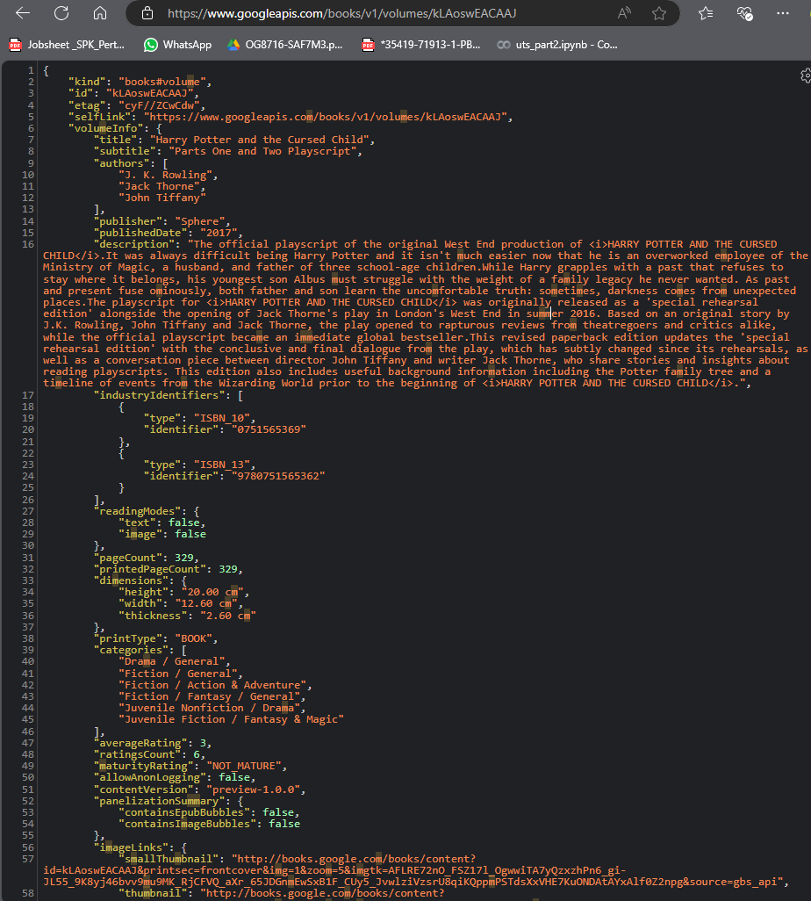

# Laporan Week 12 : Asyncronous Programming

## Informasi Mahasiswa
- **Nama:** Eddo Dava Alfarisi
- **NIM:** 2241720232

## Daftar Isi
- [Laporan Week 12 : Asyncronous Programming](#laporan-week-12--asyncronous-programming)
  - [Informasi Mahasiswa](#informasi-mahasiswa)
  - [Daftar Isi](#daftar-isi)
  - [W12: Soal 1](#w12-soal-1)
    - [Pertanyaan](#pertanyaan)
      - [Tambahkan nama panggilan Anda pada title app sebagai identitas hasil pekerjaan Anda.](#tambahkan-nama-panggilan-anda-pada-title-app-sebagai-identitas-hasil-pekerjaan-anda)
    - [Jawaban](#jawaban)
  - [W12: Soal 2](#w12-soal-2)
    - [Pertanyaan](#pertanyaan-1)
    - [Carilah judul buku favorit Anda di Google Books, lalu ganti ID buku pada variabel path di kode tersebut. Caranya ambil di URL browser Anda seperti gambar berikut ini.Kemudian cobalah akses di browser URI tersebut dengan lengkap seperti ini. Jika menampilkan data JSON, maka Anda telah berhasil. Lakukan capture milik Anda dan tulis di README pada laporan praktikum. Lalu lakukan commit dengan pesan "W12: Soal 2".](#carilah-judul-buku-favorit-anda-di-google-books-lalu-ganti-id-buku-pada-variabel-path-di-kode-tersebut-caranya-ambil-di-url-browser-anda-seperti-gambar-berikut-inikemudian-cobalah-akses-di-browser-uri-tersebut-dengan-lengkap-seperti-ini-jika-menampilkan-data-json-maka-anda-telah-berhasil-lakukan-capture-milik-anda-dan-tulis-di-readme-pada-laporan-praktikum-lalu-lakukan-commit-dengan-pesan-w12-soal-2)
    - [Jawaban](#jawaban-1)
  - [W12: Soal 3](#w12-soal-3)
    - [Pertanyaan](#pertanyaan-2)
      - [Jelaskan maksud kode langkah 5 tersebut terkait substring dan catchError!](#jelaskan-maksud-kode-langkah-5-tersebut-terkait-substring-dan-catcherror)
      - [Capture hasil praktikum Anda berupa GIF dan lampirkan di README. Lalu lakukan commit dengan pesan "W12: Soal 3".](#capture-hasil-praktikum-anda-berupa-gif-dan-lampirkan-di-readme-lalu-lakukan-commit-dengan-pesan-w12-soal-3)
    - [Jawaban](#jawaban-2)
  - [W12: Soal 4](#w12-soal-4)
    - [Pertanyaan](#pertanyaan-3)
      - [Jelaskan maksud kode langkah 1 dan 2 tersebut!](#jelaskan-maksud-kode-langkah-1-dan-2-tersebut)
      - [Capture hasil praktikum Anda berupa GIF dan lampirkan di README. Lalu lakukan commit dengan pesan "W12: Soal 4".](#capture-hasil-praktikum-anda-berupa-gif-dan-lampirkan-di-readme-lalu-lakukan-commit-dengan-pesan-w12-soal-4)
    - [Jawaban](#jawaban-3)
  - [W12: Soal 5](#w12-soal-5)
    - [Pertanyaan](#pertanyaan-4)
      - [Jelaskan maksud kode langkah 2 tersebut!](#jelaskan-maksud-kode-langkah-2-tersebut)
      - [Capture hasil praktikum Anda berupa GIF dan lampirkan di README. Lalu lakukan commit dengan pesan "W12: Soal 5".](#capture-hasil-praktikum-anda-berupa-gif-dan-lampirkan-di-readme-lalu-lakukan-commit-dengan-pesan-w12-soal-5)
    - [Jawaban](#jawaban-4)
  - [W12: Soal 6](#w12-soal-6)
    - [Pertanyaan](#pertanyaan-5)
    - [Jawaban](#jawaban-5)
      - [langkah 5](#langkah-5)
      - [langkah 6](#langkah-6)
  - [W12: Soal 7](#w12-soal-7)
    - [Pertanyaan](#pertanyaan-6)
    - [Jawaban](#jawaban-6)
  - [W12: Soal 8](#w12-soal-8)
    - [Pertanyaan](#pertanyaan-7)
      - [Jelaskan maksud perbedaan kode langkah 1 dan 4!](#jelaskan-maksud-perbedaan-kode-langkah-1-dan-4)
    - [Jawaban](#jawaban-7)
      - [langkah 1](#langkah-1)
      - [langkah 4](#langkah-4)
  - [W12: Soal 9](#w12-soal-9)
    - [Pertanyaan](#pertanyaan-8)
    - [Jawaban](#jawaban-8)
  - [W12: Soal 10](#w12-soal-10)
    - [Pertanyaan](#pertanyaan-9)
    - [Jawaban](#jawaban-9)
  - [W12: Soal 11](#w12-soal-11)
    - [Pertanyaan](#pertanyaan-10)
    - [Jawaban](#jawaban-10)
  - [W12: Soal 12](#w12-soal-12)
    - [Pertanyaan](#pertanyaan-11)
    - [Jawaban](#jawaban-11)
  - [W12: Soal 13](#w12-soal-13)
    - [Pertanyaan](#pertanyaan-12)
    - [Jawaban](#jawaban-12)
  - [W12: Soal 14](#w12-soal-14)
    - [Pertanyaan](#pertanyaan-13)
    - [Jawaban](#jawaban-13)
  - [W12: Soal 15](#w12-soal-15)
    - [Pertanyaan](#pertanyaan-14)
    - [Jawaban](#jawaban-14)
  - [W12: Soal 16](#w12-soal-16)
    - [Pertanyaan](#pertanyaan-15)
    - [Jawaban](#jawaban-15)
  - [W12: Soal 17](#w12-soal-17)
    - [Pertanyaan](#pertanyaan-16)
    - [Jawaban](#jawaban-16)

## W12: Soal 1
### Pertanyaan
#### Tambahkan nama panggilan Anda pada title app sebagai identitas hasil pekerjaan Anda.
### Jawaban

```dart
class MyApp extends StatelessWidget {
  @override
  Widget build(BuildContext context) {
    return MaterialApp(
      title: 'Eddo Dava - 2241720232',
      theme: ThemeData(
        primarySwatch: Colors.blue,
      ),
      home: const FuturePage(),
    );
  }
}
```

## W12: Soal 2
### Pertanyaan
### Carilah judul buku favorit Anda di Google Books, lalu ganti ID buku pada variabel path di kode tersebut. Caranya ambil di URL browser Anda seperti gambar berikut ini.Kemudian cobalah akses di browser URI tersebut dengan lengkap seperti ini. Jika menampilkan data JSON, maka Anda telah berhasil. Lakukan capture milik Anda dan tulis di README pada laporan praktikum. Lalu lakukan commit dengan pesan "W12: Soal 2".
### Jawaban



## W12: Soal 3
### Pertanyaan
#### Jelaskan maksud kode langkah 5 tersebut terkait substring dan catchError!
#### Capture hasil praktikum Anda berupa GIF dan lampirkan di README. Lalu lakukan commit dengan pesan "W12: Soal 3".
### Jawaban

```dart
ElevatedButton(
    child: const Text('Go'),
    onPressed: (){
        setState(() {});
        getData().then((value) {
            result = value.body.toString().substring(0,450);
            setState(() {});
        }).catchError((_){
            result = 'An Error Occured';
            setState(() {});
        });
    },
),
```
<br>
Maksudnya adalah kode tersebut menggunakan `substring` untuk mengambil 450 karakter pertama dari hasil respons `value.body`. Jika terjadi kesalahan saat mengambil data, `catchError` akan menangkap kesalahan tersebut dan mengatur `result` menjadi 'An Error Occured'.
<br>
<br>

<video controls src="20241108-0049-51.1344183.mp4" title="Title"></video>
<br>

## W12: Soal 4
### Pertanyaan
#### Jelaskan maksud kode langkah 1 dan 2 tersebut!
#### Capture hasil praktikum Anda berupa GIF dan lampirkan di README. Lalu lakukan commit dengan pesan "W12: Soal 4".

### Jawaban
```dart
Future<int> returnOneAsync() async {
    await Future.delayed(const Duration(seconds: 1));
    return 1;
  }

  Future<int> returnTwoAsync() async {
    await Future.delayed(const Duration(seconds: 1));
    return 2;
  }

  Future<int> returnThreeAsync() async {
    await Future.delayed(const Duration(seconds: 1));
    return 3;
  }

  Future count() async {
    int total = 0;
    total += await returnOneAsync();
    total += await returnTwoAsync();
    total += await returnThreeAsync();
    setState(() {
      result = total.toString();
    });
  }
```
<br>
Maksud dari program tersebut merupakan 
fungsi `count` yang memanggil tiga fungsi asinkron `returnOneAsync`, `returnTwoAsync`, dan `returnThreeAsync` secara berurutan. Setiap fungsi asinkron ini menunggu selama satu detik sebelum mengembalikan nilai masing-masing (1, 2, dan 3). Nilai-nilai ini kemudian dijumlahkan dan hasilnya disimpan dalam variabel `total`. Setelah semua fungsi selesai dieksekusi, `setState` dipanggil untuk memperbarui UI dengan hasil penjumlahan tersebut.

<br><br>
<video controls src="20241108-0057-14.4889553.mp4" title="Title"></video>
<br><br>

## W12: Soal 5
### Pertanyaan
#### Jelaskan maksud kode langkah 2 tersebut!
#### Capture hasil praktikum Anda berupa GIF dan lampirkan di README. Lalu lakukan commit dengan pesan "W12: Soal 5".
### Jawaban

```dart
late Completer completer;

Future getNumber() {
  completer = Completer<int>();
  calculate();
  return completer.future;
}

Future calculate() async {
  await Future.delayed(const Duration(seconds : 5));
  completer.complete(42);
}
```
<br>
Maksud dari program tersebut adalah fungsi `getNumber` yang menginisialisasi sebuah `Completer` dan memanggil fungsi `calculate`. Fungsi `calculate` menunggu selama lima detik sebelum menyelesaikan `Completer` dengan nilai 42. Nilai ini kemudian dapat diakses melalui properti `future` dari `Completer`. yang kemudian akan diload melalui set state pada onpresed GO

<br><br>
<video controls src="20241108-0105-30.3756281.mp4" title="Title"></video>
<br><br>

## W12: Soal 6
### Pertanyaan
### Jawaban

#### langkah 5 
```dart
Future calculate2() async {
    try {
      await Future.delayed(const Duration(seconds : 5));
      completer.complete(42);
    } catch (_) {
      completer.completeError({});
    }
  }
```
#### langkah 6
```dart
getNumber().then((value) {
  setState(() {
    result = value.toString();
  });
}).catchError((e) {
  result = 'An error occurred';
});
```
<br>
Maksud perbedaan langkah 2 dengan langkah 5-6 tersebut adalah ditambahkannya fungsi trycatch untuk penanganan error 
<br><br>
<video controls src="20241108-0113-18.4540501.mp4" title="Title"></video>
<br><br>

## W12: Soal 7
### Pertanyaan
**Capture hasil praktikum Anda berupa GIF dan lampirkan di README. Lalu lakukan commit dengan pesan "W12: Soal 7".**
### Jawaban
<br><br>
<video controls src="20241108-0124-33.3843614.mp4" title="Title"></video>
<br><br>

## W12: Soal 8
### Pertanyaan
#### Jelaskan maksud perbedaan kode langkah 1 dan 4! 
### Jawaban
#### langkah 1 
```dart
     FutureGroup<int> futureGroup = FutureGroup<int>();
     futureGroup.add(returnOneAsync());
     futureGroup.add(returnTwoAsync());
     futureGroup.add(returnThreeAsync());
     futureGroup.close();
     futureGroup.future.then((List<int> value) {
       int total = 0;
       for(var element in value){
         total += element;
       }
       setState(() {
         result = total.toString();
       });
    });
```
#### langkah 4
```dart
final futures = Future.wait<int>([
      returnOneAsync(),
      returnTwoAsync(),
      returnThreeAsync(),
    ]);

    futures.then((List<int> value) {
      int total = 0;
      for(var element in value){
        total += element;
      }
      setState(() {
        result = total.toString();
      });
    });
```
<br>
Perbedaan dari langkah 1 dan 4 adalah langkah 1 menggunakan `FutureGroup` untuk mengelola beberapa `Future` dan menunggu hingga semuanya selesai sebelum melanjutkan. Sedangkan langkah 4 menggunakan `Future.wait` untuk menunggu beberapa `Future` secara bersamaan dan mengembalikan hasilnya dalam bentuk daftar setelah semuanya selesai. Kedua cara ini bertujuan untuk menjalankan beberapa operasi asinkron secara paralel dan mengumpulkan hasilnya.
<br><br>
<video controls src="20241108-0136-24.7876536.mp4" title="Title"></video>
<br><br>

## W12: Soal 9
### Pertanyaan
 **Capture hasil praktikum Anda berupa GIF dan lampirkan di README. Lalu lakukan commit dengan pesan "W12: Soal 9".**
### Jawaban
<br><br>
<video controls src="20241108-0146-27.6036350.mp4" title="Title"></video>
<br><br>

## W12: Soal 10
### Pertanyaan
 **Panggil method handleError() tersebut di ElevatedButton, lalu run. Apa hasilnya? Jelaskan perbedaan kode langkah 1 dan 4!**
### Jawaban
Hasilnya sama saja , yang membedakan dari kode diatas adalah untuk langkah 1 handling error berada pada onpresed secara langsung sedangkan pada langkah 4 dibuatkan fungsi async khusus untuk handling error dimana didalamnya terdapat await untuk menjalankan fungsi pada langkah 1 terlebih dahulu dan pada main hanya perlu memanggil fungsi langkah 4

<br><br>
<video controls src="20241108-0151-57.5334542.mp4" title="Title"></video>
<br><br>

## W12: Soal 11
### Pertanyaan
**Tambahkan nama panggilan Anda pada tiap properti title sebagai identitas pekerjaan Anda.**
### Jawaban
```dart
@override
  Widget build(BuildContext context) {
    return Scaffold(
      appBar: AppBar(
        title: const Text('Current Location Eddo Dava Alfarisi'),
      ),
      body: Center(
        child: Column(
          children: [
            Text(myPosition),
          ],
        ),
      ),
    );
  }
```
## W12: Soal 12
### Pertanyaan
### Jawaban
<br><br>
<video controls src="20241108-0303-21.2641451.mp4" title="Title"></video>
<br><br>

## W12: Soal 13
### Pertanyaan
Apakah ada perbedaan UI dengan praktikum sebelumnya? Mengapa demikian?
Capture hasil praktikum Anda berupa GIF dan lampirkan di README. Lalu lakukan commit dengan pesan "W12: Soal 13".
Seperti yang Anda lihat, menggunakan FutureBuilder lebih efisien, clean, dan reactive dengan Future bersama UI.
### Jawaban
Terdapat perbedaan dimana sebelum menampilkan hasil geolocation terdapat loading terlebih dahulu dan kita tidak perlu mendefiniskan kembali longitude dan Latitude dan code menjadi lebih simpel
<br><br>
<video controls src="20241108-0314-05.1558979.mp4" title="Title"></video>
<br><br>

## W12: Soal 14
### Pertanyaan
Apakah ada perbedaan UI dengan langkah sebelumnya? Mengapa demikian?
Capture hasil praktikum Anda berupa GIF dan lampirkan di README. Lalu lakukan commit dengan pesan "W12: Soal 14".
### Jawaban
tidak terdapat perbedaan ui dikarenakan ui masih sama hanya terdapat handling error dan pada program ini tidak terdapat error yang membuat kode langusng ke return
<br><br>
<video controls src="20241108-0314-05.1558979.mp4" title="Title"></video>
<br><br>

## W12: Soal 15
### Pertanyaan
Soal 15
Tambahkan nama panggilan Anda pada tiap properti title sebagai identitas pekerjaan Anda.
Silakan ganti dengan warna tema favorit Anda.
### Jawaban
```dart
import 'package:flutter/material.dart';

class NavigationFirst extends StatefulWidget {
  const NavigationFirst({Key? key}) : super(key: key);

  @override
  _NavigationFirstState createState() => _NavigationFirstState();
}

class _NavigationFirstState extends State<NavigationFirst> {
  Color color = Colors.lightBlue;
  @override
  Widget build(BuildContext context) {
    return Scaffold(
      appBar: AppBar(
        title: const Text('Eddo Navigation First Screen'),
      ),
      body: Center(
        child: ElevatedButton(
          child: const Text('Go changeColor'),
          onPressed: () {
           _navigateAndGetColor();
          },
        ),
      ),
    );
  }
}
```

## W12: Soal 16
### Pertanyaan
Cobalah klik setiap button, apa yang terjadi ? Mengapa demikian ?
Gantilah 3 warna pada langkah 5 dengan warna favorit Anda!
Capture hasil praktikum Anda berupa GIF dan lampirkan di README. Lalu lakukan commit dengan pesan "W12: Soal 16".
### Jawaban
pada halaman second 
Ketika tombol ditekan, Navigator.pop mengirimkan nilai warna tersebut kembali ke halaman pertama, dan tampilan halaman pertama diperbarui untuk mencerminkan warna yang baru.
<br><br>
<video controls src="20241108-0338-59.8485775.mp4" title="Title"></video>
<br><br>

## W12: Soal 17
### Pertanyaan
### Jawaban