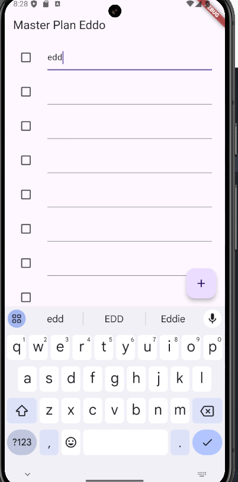
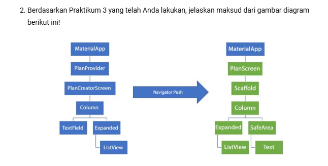

*# Master Plan Project

## Information

- **Name:** Eddo Dava Alfarisi
- **Student ID:** 2241720232
- **Class:** 3C

## Project Overview

## Praktikum 1 Widget Dasar

### Soal

1. Jelaskan maksud dari langkah 4 pada praktikum tersebut! Mengapa dilakukan demikian?<br>
   jawab :  <br>
    ```dart
    export 'plan.dart';
    export 'task.dart';
    ```
    <br>
    kode diatas merupakan kode untuk meringkas dengan cara membungkus beberapa data layer ke sebuah file yang nantinya akan di ekspor ke dua file tersebut
2. Mengapa perlu variabel plan di langkah 6 pada praktikum tersebut? Mengapa dibuat konstanta ?
   ```dart
    import '../models/data_layer.dart';
    import 'package:flutter/material.dart';

    class PlanScreen extends StatefulWidget {
    const PlanScreen({super.key});

    @override
    State createState() => _PlanScreenState();
    }

    class _PlanScreenState extends State<PlanScreen> {
    Plan plan = const Plan();

    @override
    Widget build(BuildContext context) {
        return Scaffold(
            // ganti ‘Namaku' dengan Nama panggilan Anda
            appBar: AppBar(title: const Text('Master Plan Namaku')),
            body: _buildList(),
            floatingActionButton: _buildAddTaskButton(),
        );
    }
    }
   ```
   Variabel plan merupakan representasi dari sebuah objek dari class Plan yang memiliki sebuah logika data, data ini dapat berupa daftar item dan perlu di ambil dari model data serta ditampilkan pada screen. `plan dibuat konstanta` dikarenakan instansiasi Plan yang dibuat adalah fix dan tidak akan berubah yang bersifat statis
3. Lakukan capture hasil dari Langkah 9 berupa GIF, kemudian jelaskan apa yang telah Anda buat!
   <video controls src="20241025-0115-20.4172519.mp4" title="Title"></video>
   <br>
   Hasil nya adalah menunjukkan antarmuka aplikasi yang dibuat menggunakan Flutter, yang menampilkan daftar item dengan kotak centang, serta tombol untuk menambah item baru.
   
4.  Apa kegunaan method pada Langkah 11 dan 13 dalam lifecyle state ?
Jawab : 
<br>
Langkah 11
```dart
@override
void initState() {
  super.initState();
  scrollController = ScrollController()
    ..addListener(() {
      FocusScope.of(context).requestFocus(FocusNode());
    });
}
```
Langkah 11 (initState): Menginisialisasi ScrollController dan menambahkan listener yang otomatis menghilangkan fokus dari input (misalnya, menutup keyboard) saat user mengscroll applikasi.

<br>


Langkah 12
```dart
return ListView.builder(
  controller: scrollController,
 keyboardDismissBehavior: Theme.of(context).platform ==
 TargetPlatform.iOS
          ? ScrollViewKeyboardDismissBehavior.onDrag
          : ScrollViewKeyboardDismissBehavior.manual,
```
Fungsi kode diatas adalah Menambahkan ScrollController ke ListView dan mengatur keyboard, yaitu otomatis menutup keyboard saat menggulir di iOS, dan harus ditutup manual di platform lain.


## Praktikum 2
1. Jelaskan mana yang dimaksud InheritedWidget pada langkah 1 tersebut! Mengapa yang digunakan InheritedNotifier?
   yang dimaksud dengan InheritedWidget adalah PlanProvider, yang merupakan subclass dari InheritedNotifier<ValueNotifier<Plan>>. InheritedWidget adalah kelas dasar yang digunakan di Flutter untuk memungkinkan pengaksesan data dari widget ancestor oleh widget descendant (anak/cucu) tanpa harus secara eksplisit meneruskan data tersebut melalui parameter.
2. Jelaskan maksud dari method di langkah 3 pada praktikum tersebut! Mengapa dilakukan demikian?
completedCount: Menghitung jumlah tugas yang telah selesai dari daftar tugas.
completenessMessage: Menyediakan pesan yang menunjukkan jumlah tugas selesai dari total tugas, dalam format mudah dibaca.
3.  Lakukan capture hasil dari Langkah 9 berupa GIF, kemudian jelaskan apa yang telah Anda buat!
<video controls src="hasil2.mp4" title="Title"></video>

### Praktikum 3


(Sebelum Navigasi):

Aplikasi dimulai dengan MaterialApp, kemudian ada PlanProvider yang berfungsi mengelola logika atau data aplikasi. Tampilan awalnya adalah PlanCreatorScreen, dengan menggunakan Column sebagai tata letaknya. Di dalam Column ini, ada TextField untuk input teks dan Expanded yang digunakan agar ListView bisa tampil dinamis sesuai dengan ukuran layar.

Navigasi dengan Push:

Setelah pengguna berinteraksi, kita menggunakan Navigator.push untuk berpindah dari PlanCreatorScreen ke tampilan baru, yaitu PlanScreen.

Diagram Kanan (Setelah Navigasi):

Di layar baru, PlanScreen ditampilkan dengan Scaffold sebagai struktur utamanya, untuk mengatur tata letak. Column tetap digunakan untuk menyusun widget, tetapi di layar ini, SafeArea juga ditambahkan agar konten tidak terpotong oleh area notifikasi atau tepi layar. Expanded dan ListView masih digunakan untuk menampilkan daftar item, ditambah dengan widget Text untuk menampilkan teks.

<video controls src="hasil3.mp4" title="Title"></video>