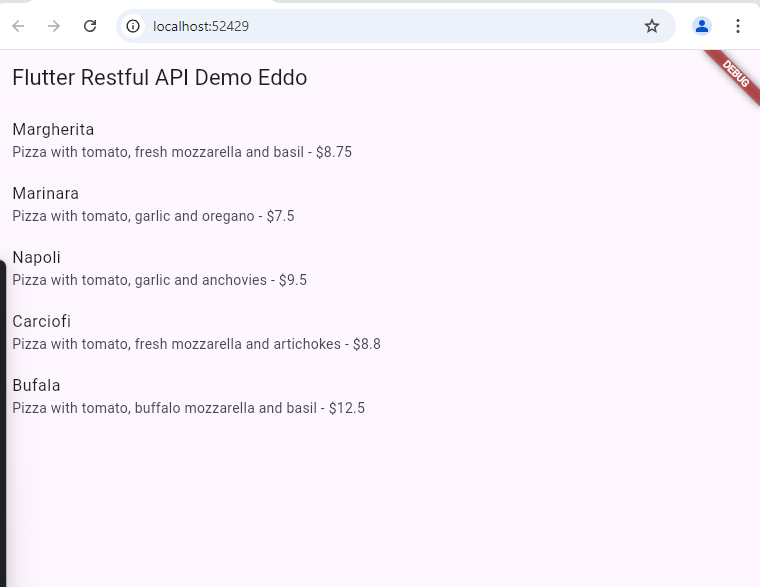
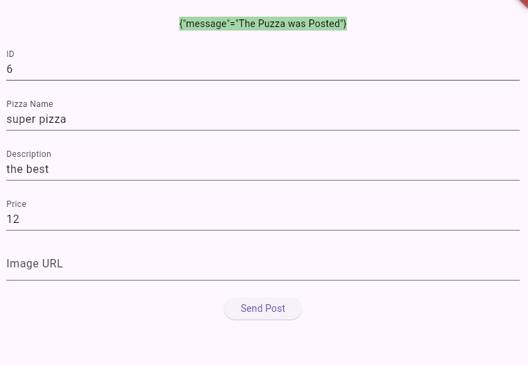

# Laporan Week 14: RESTful API

## Daftar Isi
- [Laporan Week 14: RESTful API](#laporan-week-14-restful-api)
  - [Daftar Isi](#daftar-isi)
  - [Praktikum 1: Membuat Endpoint Get](#praktikum-1-membuat-endpoint-get)
  - [Praktikum 2: Membuat Endpoint Post](#praktikum-2-membuat-endpoint-post)
  - [Praktikum 3: Membuat Endpoint POST](#praktikum-3-membuat-endpoint-post)
  - [Praktikum 4: Membuat Endpoint PUT dan DELETE](#praktikum-4-membuat-endpoint-put-dan-delete)

## Praktikum 1: Membuat Endpoint Get


```dart
import 'dart:io';
import 'dart:convert';
import 'package:http/http.dart' as http;
import 'pizza.dart';

class HttpHelper{
  final String authority = 'q0vqg.wiremockapi.cloud';
  final String path = 'pizzalist';

  Future<List<Pizza>> getPizzaList() async {
    final Uri url = Uri.https(authority, path);
    final http.Response result = await http.get(url);
    if (result.statusCode == HttpStatus.ok) {
      final List<dynamic> body = jsonDecode(result.body);
      List<Pizza> pizzas = body.map<Pizza>((i)=> Pizza.fromJson(i)).toList();
      return pizzas;
    } else {
      return [];
    }
  }
}
```


Diatas adalah hasil dari percobaan mengambil data dari API menggunakan dependency dari `http` yang menggunakan method `http.get()` yaitu pada baris ke-12 dimana isi dari URL adalah `Uri.https(authority, path)`. yaitu link dan route nya


## Praktikum 2: Membuat Endpoint Post
```dart
Future<String> postPizza(Pizza pizza) async{
    const postPath = "/pizza";
    String post = json.encode(pizza.toJson());
    Uri url = Uri.https(authority, postPath);
    http.Response r = await http.post(url, body: post);
    return r.body;
  }
```



Diatas adalah hasil dari percobaan post data ke api , Ketika pengguna mengisi form di PizzaDetailScreen dan menekan tombol "Send Post", metode postPizza() akan dipanggil. Metode ini akan membuat objek Pizza dari input pengguna dan mengirimkannya ke server menggunakan HttpHelper. Hasil dari operasi ini akan ditampilkan di layar.


## Praktikum 3: Membuat Endpoint POST
Pada praktikum ini, kita akan membuat endpoint POST untuk mengirim data ke server.

## Praktikum 4: Membuat Endpoint PUT dan DELETE
Pada praktikum ini, kita akan membuat endpoint PUT untuk memperbarui data dan endpoint DELETE untuk menghapus data dari server.