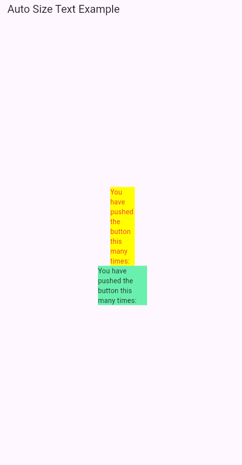

Berikut adalah template README yang sesuai dengan gaya bahasa Anda:

---

# Praktikum Flutter dengan Plugin `auto_size_text`

## Langkah 1: Buat Project Baru
Buatlah project Flutter baru dengan nama **`auto_size_text`**. Setelah itu, jadikan project tersebut sebagai repository GitHub dengan nama yang sama.

## Langkah 2: Menambahkan Plugin
Tambahkan plugin `auto_size_text` dengan perintah di terminal:
```bash
flutter pub add auto_size_text
```
Jika berhasil, maka di file **pubspec.yaml** akan muncul nama plugin beserta versinya pada bagian `dependencies`.


**saat saya menginstall saya mengalami error dimana plugin tidak bisa ke install dikarenakan nama projek yang sama dengan plugin**

jadi saya mengubah nama project menjadi `project_auto_size_text` saya ubah pada yaml
```yaml
name: project_auto_size_text
```

## Langkah 3: Buat file `red_text_widget.dart`
Buat file baru di dalam folder **lib** dengan nama **`red_text_widget.dart`**, kemudian tambahkan kode berikut:
```dart
import 'package:flutter/material.dart';

class RedTextWidget extends StatelessWidget {
  const RedTextWidget({Key? key}) : super(key: key);

  @override
  Widget build(BuildContext context) {
    return Container();
  }
}
```

## Langkah 4: Tambahkan Widget `AutoSizeText`
Untuk menggunakan plugin **auto_size_text**, ubah kode **return Container()** menjadi:
```dart
return AutoSizeText(
  text,
  style: const TextStyle(color: Colors.red, fontSize: 14),
  maxLines: 2,
  overflow: TextOverflow.ellipsis,
);
```
Saat saya menambahkan kode ini, terdapat  error. Error terjadi dikarenakan variabel `text` belum didefinisikan di dalam class. Error ini akan diperbaiki pada langkah berikutnya.

## Langkah 5: Buat Variabel `text` dan Parameter di Constructor
Tambahkan variabel `text` dan parameter di constructor agar bisa digunakan dalam widget **AutoSizeText**. Kode nya adalah  seperti berikut:
```dart
final String text;

const RedTextWidget({Key? key, required this.text}) : super(key: key);
```

`{Key? key, required this.text}`: Ini adalah parameter konstruktor untuk widget ini

`Key? key`: Ini adalah parameter opsional yang biasanya digunakan untuk mengidentifikasi widget unik dalam aplikasi Flutter. Bisa diabaikan jika tidak digunakan.

`required this.text`: Parameter required berfungsi ketika widget ini dibuat, nilai untuk text wajib diisi. Kata kunci this.text mengacu pada variabel text yang sudah dideklarasikan sebelumnya di dalam class. jadi nantinya , nilai yang dioper saat instansiasi widget akan disimpan di variabel text.

`super(key: key)`: Ini adalah panggilan ke konstruktor superclass (yaitu StatelessWidget) untuk menginisialisasi key. Key digunakan untuk mengidentifikasi widget dalam widget tree Flutter, terutama jika ada perubahan state yang terjadi pada widget tersebut.

## Langkah 6: Tambahkan Widget di `main.dart`
Buka file **main.dart** dan tambahkan widget di dalam `children:` pada class `_MyHomePageState`:
```dart
Container(
  color: Colors.yellowAccent,
  width: 50,
  child: const RedTextWidget(
    text: 'You have pushed the button this many times:',
  ),
),
Container(
  color: Colors.greenAccent,
  width: 100,
  child: const Text(
    'You have pushed the button this many times:',
  ),
),
```

## Penjelasan:
1. **Langkah 6 - Fungsi dan Perbedaan Widget**:
   - **RedTextWidget dengan AutoSizeText**: Teks dalam widget ini akan menyesuaikan ukuran font secara otomatis agar pas dengan area yang diberikan, sesuai dengan `maxLines` yang diatur.
   - **Text Biasa**: Widget ini tidak menyesuaikan ukuran font secara otomatis. Jika teks terlalu panjang, maka akan terpotong atau memakan baris tambahan.

## Hasil
Setelah menjalankan aplikasi, tampilan akan seperti gambar di bawah ini:



## Kumpulkan Laporan
Setelah menyelesaikan praktikum, push seluruh pekerjaan ke repository GitHub dan kirimkan link repository kepada dosen.

---

Anda bisa mengubah bagian **screenshot.png** dengan screenshot hasil dari aplikasi Anda. Setelah itu, jangan lupa untuk push seluruh file ke GitHub.