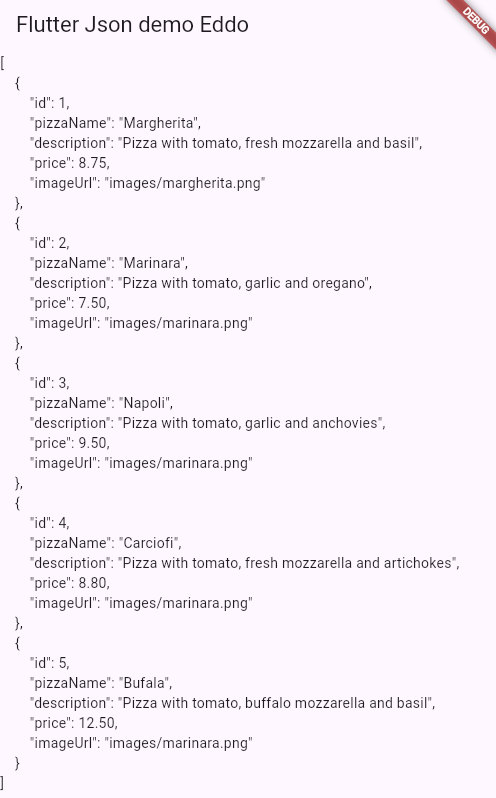
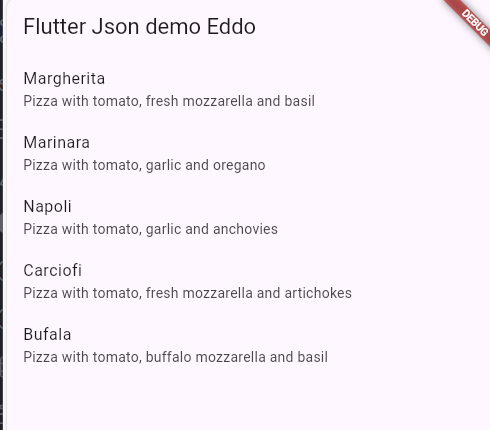
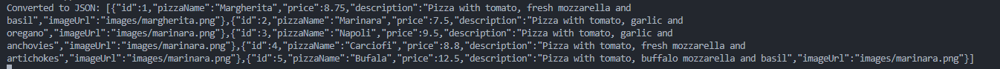
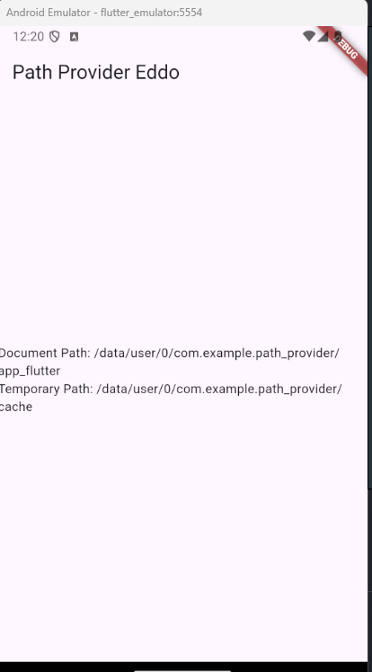
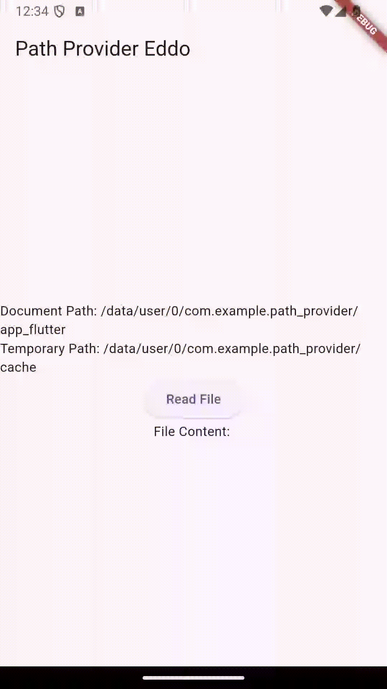

# Week 14: Persistensi Data

## Daftar Isi
- [Week 14: Persistensi Data](#week-14-persistensi-data)
  - [Daftar Isi](#daftar-isi)
  - [Praktikum 1](#praktikum-1)
  - [Praktikum 2](#praktikum-2)
  - [Praktikum 3](#praktikum-3)
  - [Praktikum 4](#praktikum-4)
  - [Praktikum 5](#praktikum-5)
  - [Praktikum 6](#praktikum-6)

## Praktikum 1

Hasil dari praktikum langkah 1-9 tersebut merupakan sebuah cara untuk mengambil dan membaca data dari file json menggunakan fungsi .loadString

kemudian lanjutan dari langkah 11 sampai 22 adalah sebuah proses mengubah sebuah string menjadi list of object dengan menambahkan konstruktor from json dan menggunakan dart convert yang dilanjut

## Praktikum 2

Kemudian hasil pada praktikum 2 adalah sebuah pembuatan method baru pada kelas pizza untuk mengembalikan sebuah map dari objek yang dapat direalisasikan kembali menjadi string dengan method convert to Json yang memanggil metode jsonEncode dari dart:convert kemudian terakhir dilakukan pengecekkan menggunakan debug 

## Praktikum 3

hasi dari gambar tersebut adalah langkah dari praktikum 3 yang membuat sebuah fungsi untuk menghitung berapa kali kita membuka aplikasi ini yang disimpan menggunakan library shared_preferences

hasil diatas merupakan hasil dari pembuatan fungsi tambahan untuk menghapus data yang telah disimpan 

## Praktikum 4
Dengan menggunakan dependency dari path provide maka kita bisa mendapatkan informasi path dari folder aplikasi yang sudah dibuat

## Praktikum 5
Kemudian pada praktikum 5 menggunakan dart io untuk menulis/membuat dan membaca file denhgan fungsi myFile.writingAsString() untuk menulis file sebagao string dan myFile.readAsString untuk membaca file sebagai string juga

## Praktikum 6

