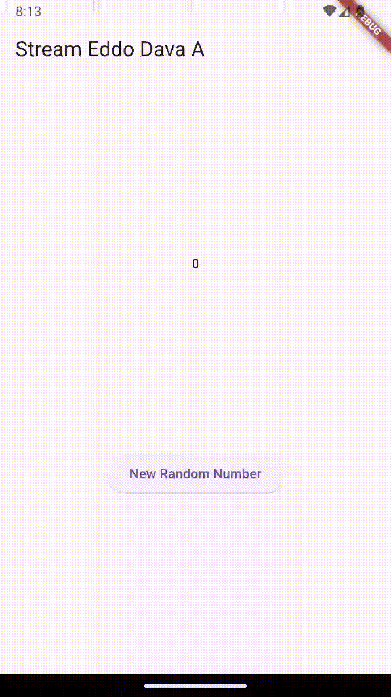

# Daftar Isi

- [Daftar Isi](#daftar-isi)
  - [Soal 1](#soal-1)
  - [Soal 2](#soal-2)
  - [Soal 3](#soal-3)
  - [Soal 4](#soal-4)
  - [Soal 5](#soal-5)
  - [Soal 6](#soal-6)
  - [Soal 7](#soal-7)
  - [Soal 8](#soal-8)
  - [Soal 9](#soal-9)
  - [Soal 10](#soal-10)
  - [Soal 11](#soal-11)
  - [Soal 12](#soal-12)

## Soal 1
Tambahkan nama panggilan Anda pada title app sebagai identitas hasil pekerjaan Anda.
Gantilah warna tema aplikasi sesuai kesukaan Anda. Lakukan commit hasil jawaban Soal 1 dengan pesan "W13: Jawaban Soal 1"

```dart
class MyApp extends StatelessWidget {
  @override
  Widget build(BuildContext context) {
    return MaterialApp(
      title: 'Eddo Dava A',
      theme: ThemeData(
        primarySwatch: Colors.lightBlue,
      ),
      home: const StreamHomePage(),
    );
  }
}
```

## Soal 2
Tambahkan 5 warna lainnya sesuai keinginan Anda pada variabel colors tersebut.
Lakukan commit hasil jawaban Soal 2 dengan pesan "W13: Jawaban Soal 2"

```dart
import 'package:flutter/material.dart';

class ColorStream {
  final List<Color> colors =[
    Colors.red,
    Colors.yellow,
    Colors.green,
    Colors.blue,
    Colors.purple,
  ];
}
```

## Soal 3
Jelaskan fungsi keyword yield* pada kode tersebut!
Apa maksud isi perintah kode tersebut? Lakukan commit hasil jawaban Soal 3 dengan pesan "W13: Jawaban Soal 3"

```dart
  Stream<Color> getColors() async* {
    yield* Stream.periodic(
      const Duration(seconds: 1), (int t) {
        int index = t % colors.length;
        return colors[index];
    });
  }
```

fungsi keyword `yield*` adalah untuk menggabungkan stream lain ke dalam stream saat ini. Maksud dari kode tersebut adalah Pertama pada `yield* Stream.periodic(...)` digunakan untuk menghasilkan nilai dari aliran `Stream.periodic` yang menghasilkan warna dari daftar `colors` setiap detik. Dengan kata lain, setiap detik, stream ini akan mengeluarkan warna berdasarkan indeks yang dihitung dari waktu yang telah berlalu. jadi color akan berganti berdasarkan durasi nya

## Soal 4
Capture hasil praktikum Anda berupa GIF dan lampirkan di README.
Lakukan commit hasil jawaban Soal 4 dengan pesan "W13: Jawaban Soal 4"


## Soal 5
Jelaskan perbedaan menggunakan listen dan await for (langkah 9) !
Lakukan commit hasil jawaban Soal 5 dengan pesan "W13: Jawaban Soal 5"


```dart
  void changeColor() async{
    await for (var eventColor in colorStream.getColors()){
        setState(() {
           bgColor = eventColor;
        ```dart
            void changeColor() async{
                await for (var eventColor in colorStream.getColors()){
                        setState(() {
                             bgColor = eventColor;
                        });
                    }
                }

            void changeColor(){
                colorStream.getColors().listen((eventColor) {
                    setState(() {
                        bgColor = eventColor;
                    });
                });
            }
```

Perbedaan `await for` dengan `listen` adalah:

- `await for` digunakan untuk menunggu setiap event dari stream secara asynchronous dalam sebuah loop. Ini memungkinkan untuk menggunakan `await` di dalam loop untuk menunggu setiap event sebelum melanjutkan ke iterasi berikutnya.
- `listen` digunakan untuk mendaftarkan callback yang akan dipanggil setiap kali stream menghasilkan event baru. Ini tidak memblokir eksekusi kode berikutnya dan memungkinkan  untuk menangani event secara reaktif.

Jadi `await for`, itu menunggu setiap event secara berurutan, sementara `listen`, itu merespons event saat event datang tanpa menunggu. 

## Soal 6
Jelaskan maksud kode langkah 8 dan 10 tersebut!
Capture hasil praktikum Anda berupa GIF dan lampirkan di README.
Lalu lakukan commit dengan pesan "W13: Jawaban Soal 6".



Langkah 8: initState()
Inisialisasi stream untuk mendengarkan angka baru dari NumberStream. Setiap kali angka baru masuk, nilai lastNumber diperbarui dengan setState, sehingga UI menampilkan angka terbaru.

Langkah 10: addRandomNumber()
Fungsi ini menghasilkan angka acak (0–9) dan mengirimkannya ke stream. Setiap kali fungsi ini dipanggil (misalnya saat tombol ditekan), angka baru akan muncul di UI.

## Soal 7
*Deskripsi dan jawaban soal 7*

## Soal 8
*Deskripsi dan jawaban soal 8*

## Soal 9
*Deskripsi dan jawaban soal 9*

## Soal 10
*Deskripsi dan jawaban soal 10*

## Soal 11
*Deskripsi dan jawaban soal 11*

## Soal 12
*Deskripsi dan jawaban soal 12*